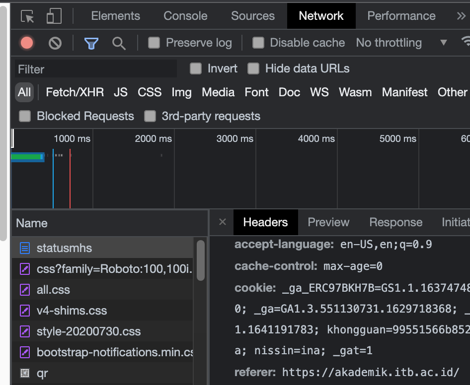

Cara gunainnya
1. pip install requests
2. pip install beautifulsoup4
3. pip install python-dotenv
3. copy .env.example ubah ke .env
4. Ambil cookie dan user agent dari inspect element di bagian network check yang statusmhs
SS:

5. py main.py atau python3 main.py atau python main.py